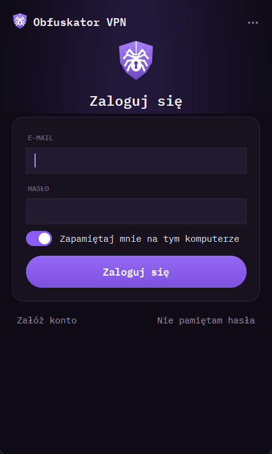
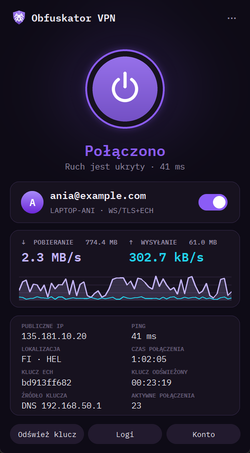
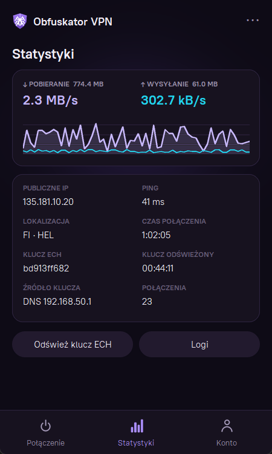

# Obfuskator VPN

Klient VPN dla Windows z kontami użytkowników. Ruch idzie przez
**VLESS + WebSocket + TLS** za Cloudflare. Nazwa serwera jest ukryta dzięki
**ECH** (Encrypted Client Hello), więc sieć widzi tylko połączenie z Cloudflare.
Aplikacja sama uruchamia [Xray-core](https://github.com/XTLS/Xray-core) (proxy)
i [sing-box](https://github.com/SagerNet/sing-box) (TUN – cały ruch komputera).
Ma też własny lokalny DNS, który podaje Xray aktualny klucz ECH.

<p align="center"></p>

<p align="center">
  
  
  
</p>

## Skąd ta aplikacja

**Problem.** Część sieci, np. w akademikach, filtruje ruch systemami DPI
(Deep Packet Inspection). Zwykłe protokoły VPN mają rozpoznawalny „podpis”
w pakietach, więc zapora łatwo je wykrywa i blokuje. Nawet w HTTPS jest luka:
pierwszy pakiet połączenia (Client Hello) zawiera nazwę domeny jawnym tekstem
(SNI), więc zapora może zablokować konkretny serwer.

**Rozwiązanie.** Ruch trzeba przebrać za zwykłe przeglądanie stron:

- **Xray z protokołem VLESS przez WebSocket i TLS.** Dla zapory cały ruch
  wygląda jak połączenie HTTPS ze stroną.
- **Cloudflare jako pośrednik.** Zamiast ciągłego transferu do jednego prywatnego
  adresu IP sieć widzi połączenia z CDN-em, który obsługuje dużą część internetu.
- **ECH (Encrypted Client Hello).** Szyfruje także nazwę domeny. Zapora widzi
  tylko anonimowy ruch HTTPS do Cloudflare i nie wie, z jaką stroną się łączysz.
- **Prawdziwa strona WWW pod tą samą domeną** (Apache). Kto wejdzie na nią
  z przeglądarki, zobaczy zwykłą stronę, a VPN działa pod tajną ścieżką.

**Dlaczego nie wystarczył v2rayN.** Ten zestaw działał z ogólnym klientem
v2rayN, ale wymagał ręcznej pracy, której nie da się wymagać od znajomych:

| Ręcznie w v2rayN | Obfuskator VPN |
|---|---|
| Reguła routingu: adres IP Cloudflare i `xray.exe` → `direct`, inaczej TUN zapętla ruch | Reguły w configu sing-box generuje aplikacja |
| `nslookup` domeny, wpisanie IP Cloudflare jako adresu serwera, ALPN `http/1.1` | Wszystko przychodzi z serwera w profilu konta |
| `dig +short HTTPS <domena>` na serwerze i wklejenie klucza `ech=…` do profilu | Klucz pobierany automatycznie |
| Cloudflare co jakiś czas zmienia klucz ECH, więc połączenie pada i trzeba wkleić nowy (dlatego powstał nawet skrypt wysyłający maila o zmianie klucza) | Aplikacja odświeża klucz w tle co kilka minut, różnymi drogami, i trzyma ostatni dobry |
| Przy włączonym TUN zapytanie Xray o klucz ECH ginęło w tunelu (`tls: malformed ECHConfigList`) | Lokalny DNS na 127.0.0.1 podaje Xray klucz z pominięciem TUN |
| Każdy znajomy dostawał osobny UUID dopisywany ręcznie do configu Xray, z restartem serwera | Konta z rejestracją i akceptacją, UUID dodawane do Xray bez restartu |

## Funkcje

- Rejestracja i logowanie (e-mail i hasło). Adres potwierdzasz kodem z maila,
  a dostęp przyznaje administrator.
- Każde urządzenie dostaje własny UUID. Na jednym koncie mogą działać do 3 komputerów.
- „Zapamiętaj mnie”: sesja jest zaszyfrowana Windows DPAPI.
- Cały ruch idzie przez TUN (StrictRoute), a QUIC jest blokowany, żeby ruch wracał do TCP w tunelu.
- Klucz ECH jest pobierany w tle kilkoma drogami. Ostatni dobry klucz jest zapisywany,
  więc rotacja kluczy w Cloudflare nie zrywa połączenia.
- Kompaktowe okno: przycisk połączenia z prędkością i pingiem, zakładki Statystyki
  (wykres, publiczne IP, klucz ECH) i Konto. Ikona w zasobniku pokazuje stan.

## Jak to działa

```
Aplikacja ──ECH/TLS──► Cloudflare ──► Apache ──┬─ /<ścieżka VPN>   → Xray "vpn"   (UUID urządzeń)
                                               └─ /<ścieżka gościa> → Xray "guest" (jeden publiczny UUID)
                                                                        │
                       API kont (FastAPI + SQLite, tylko 127.0.0.1) ◄───┘  ← jedyny cel dostępny dla gościa
```

**Problem:** logowanie odbywa się przed włączeniem VPN-a, a sieć blokuje serwer.
**Rozwiązanie:** aplikacja ma wbudowany UUID gościa. Reguły Xray na serwerze
pozwalają mu łączyć się wyłącznie z API kont. Po akceptacji konta API wydaje
urządzeniu własny UUID, a aplikacja przełącza się na zwykłe połączenie.

**Bezpieczeństwo w skrócie:**

- **Rozmowa z API:** szyfruje ją dodatkowo TLS z certyfikatem przypiętym
  w aplikacji. Cloudflare rozszyfrowuje WebSocket i bez tego widziałby hasła.
- **Hasła:** argon2id.
- **Tokeny i kody z maili:** baza przechowuje tylko ich skróty.
- **Limity prób:** liczone na konto i globalnie.
- **Dostęp do API Xray, usług lokalnych serwera, sieci prywatnych i portu 25:**
  zablokowany z tuneli.
- **Dane wejścia gościa w exe:** są tylko **zaciemnione**, nie zaszyfrowane.
  Gość ma jednak dostęp wyłącznie do API logowania, więc nie są tajemnicą.

## Instalacja (użytkownik)

1. Pobierz `ObfuskatorVPN-<wersja>.zip` z [Releases](../../releases).
2. Rozpakuj go do stałego folderu, np. `C:\ObfuskatorVPN`, i uruchom `ObfuskatorVPN.exe`.
3. Załóż konto i wpisz kod z maila. Po akceptacji konta aplikacja połączy się sama.

Szczegóły są w [src/paczka/CZYTAJ.txt](src/paczka/CZYTAJ.txt), a dane, które
zbiera serwer, opisuje [src/paczka/PRYWATNOSC.txt](src/paczka/PRYWATNOSC.txt).

## Własny serwer

### 1. Infrastruktura: VPS, domena za Cloudflare, strona WWW, Xray

Przykład dla VPS-a [Mikrus](https://mikr.us). Panel Mikrusa daje darmową
subdomenę, która działa za Cloudflare (stąd ECH) i ma gotowy certyfikat SSL.
Nie trzeba kupować domeny ani zakładać konta w Cloudflare.

1. **Subdomena.** W panelu Mikrusa otwórz **Sieć i domeny → Subdomeny**,
   utwórz subdomenę (np. `twojanazwa.bieda.it`) i przypisz ją do swojego
   serwera na porcie 443.
2. **Strona WWW jako kamuflaż.** Po zalogowaniu przez SSH zainstaluj Apache skryptem Mikrusa:
   ```bash
   cd ~/noobs/scripts && ./chce_LAMP.sh
   ```
   Po instalacji pod adresem subdomeny powinna się wyświetlić strona testowa.
3. **Xray i tajna ścieżka WebSocket przez Apache:**
   ```bash
   bash -c "$(curl -L https://github.com/XTLS/Xray-install/raw/main/install-release.sh)" @ install
   UUID=$(xray uuid); WSPATH=/$(openssl rand -hex 8)
   cat > /usr/local/etc/xray/config.json <<EOF
   {
     "log": {"loglevel": "warning"},
     "inbounds": [{
       "listen": "127.0.0.1", "port": 10900, "protocol": "vless",
       "settings": {"clients": [{"id": "$UUID"}], "decryption": "none"},
       "streamSettings": {"network": "ws", "wsSettings": {"path": "$WSPATH"}}
     }],
     "outbounds": [{"protocol": "freedom"}]
   }
   EOF
   systemctl enable xray && systemctl restart xray
   a2enmod proxy proxy_http proxy_wstunnel
   echo "ProxyPass \"$WSPATH\" \"http://127.0.0.1:10900$WSPATH\" upgrade=websocket" \
     > /etc/apache2/conf-available/xray.conf
   a2enconf xray && apache2ctl configtest && systemctl reload apache2
   echo "Ścieżka VPN: $WSPATH"
   ```
   Zapisz wypisaną ścieżkę. To `vpn_path` w `src/serwer_prywatny.json`.
4. **Adres IP Cloudflare dla domeny:** `nslookup twojanazwa.bieda.it`. Jeden z adresów
   wpisz jako `host` w `src/serwer_prywatny.json`. Aplikacja łączy się z tym adresem,
   a nazwa domeny jest ukryta w ECH.

### 2. Konta użytkowników

Kod serwera jest w [server/](server/): API kont, synchronizacja użytkowników
z Xray przez `xray api` (bez restartu) i CLI `akvpn-admin`. Na przygotowanym
w kroku 1 serwerze wdrażasz go według [server/INSTRUKCJA_SERWER.md](server/INSTRUKCJA_SERWER.md).
Skrypt `xray_config.py` z tej instrukcji przebudowuje config Xray: dodaje wejście
gościa, API Xray i reguły blokujące oraz zachowuje dotychczasowych klientów
na czas przejścia.

### 3. Aplikacja pod własny serwer

Budowanie aplikacji pod własny serwer (Windows, Python 3.11, `pip install pillow pystray pyinstaller`):

1. Skopiuj `src/serwer_prywatny.przyklad.json` do `src/serwer_prywatny.json` i wpisz swoje dane.
2. Wygeneruj certyfikat API:
   `openssl req -x509 -newkey ec -pkeyopt ec_paramgen_curve:P-256 -nodes -days 7300 -subj "/CN=akvpn-api" -keyout server/tajne/tls.key -out server/tajne/tls.crt`
3. Wgraj `xray.exe` i `sing-box.exe` do folderu `bin/`.
4. Uruchom `src\build.cmd`, który zbuduje i zainstaluje aplikację. `src\pakiet.cmd` tworzy paczkę zip.
5. `python server\zbuduj_paczke.py` składa paczkę na serwer.

## Znane ograniczenia

- **Adres IP Cloudflare jest stały.** Jeśli przestanie odpowiadać, zmień `host`
  w `src/serwer_prywatny.json` (wejście gościa, wymaga przebudowania exe)
  i w `vpn_link_template` w `/etc/akvpn/config.json` na serwerze.
- **Gry online (UDP).** Cloudflare przenosi przez WebSocket tylko TCP, więc UDP
  jedzie w środku TCP. Przy utracie pakietów rośnie opóźnienie, co czuć w grach FPS.
- **Brak podpisu cyfrowego exe.** Windows SmartScreen pokazuje ostrzeżenie przy
  pierwszym uruchomieniu.
- **Tylko Windows.** Aplikacja korzysta z TUN przez sing-box, DPAPI i harmonogramu zadań.

## Testy

```
cd server && python -m pytest tests/test_api.py          # API (podstawione Xray i poczta)
python server\tests\e2e_lokalny.py                         # pełny przebieg z prawdziwym xray.exe
```

## Licencja

Kod w tym repozytorium jest udostępniany na licencji [MIT](LICENSE). Xray-core (MPL-2.0),
sing-box (GPL-3.0+), czcionka PT Root UI (OFL) i biblioteki w paczce mają
własne licencje. Ich spis jest w [src/paczka/LICENCJE.txt](src/paczka/LICENCJE.txt),
a pełne teksty w [src/paczka/licencje/](src/paczka/licencje/).

Korzystając z aplikacji, przestrzegaj regulaminu swojej sieci i prawa.
Autor nie odpowiada za sposób jej użycia.
